# Assignment #3 — Responsive Web Design

**Name:** Yerkezhan Vassenzhan  
**Group:** IT-2504  

## Home Page

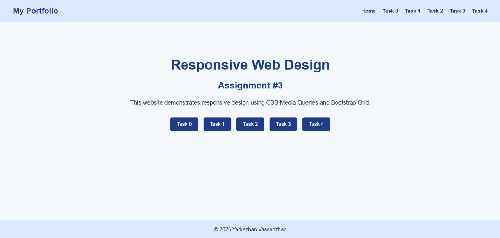
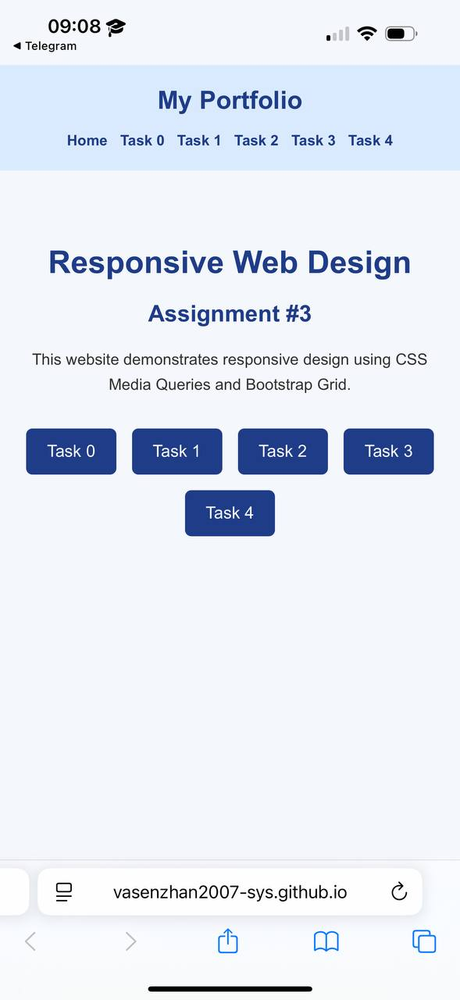

## Task 0 — Responsive Typography

Created responsive headings and paragraphs using **CSS Media Queries** for mobile, tablet and desktop screens.

### Screenshots:
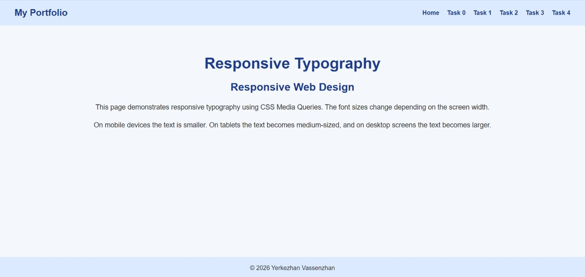
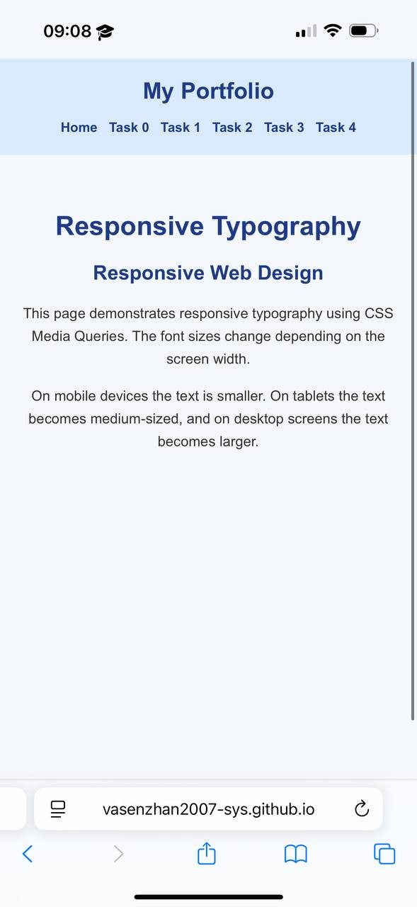

## Task 1 — Responsive Layout

Created three boxes using **CSS Media Queries**. The boxes are displayed in one row on desktop, two per row on tablet, and stacked on mobile.

### Screenshots:
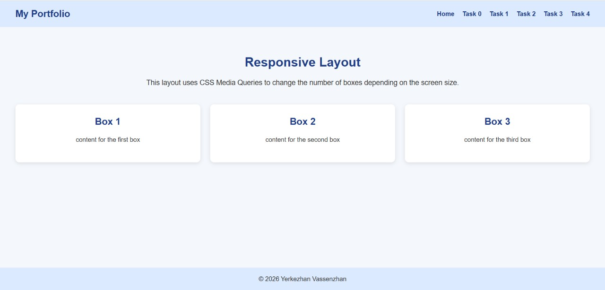
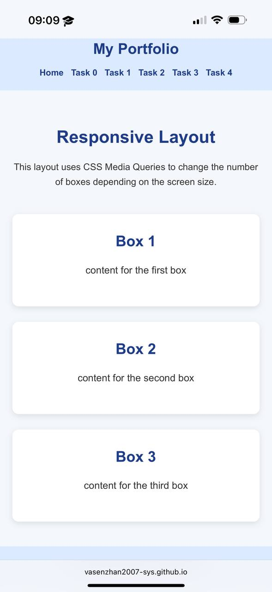

## Task 2 — Bootstrap Responsive Columns

Created three responsive columns using the **Bootstrap 12-column Grid**.

### Screenshots:
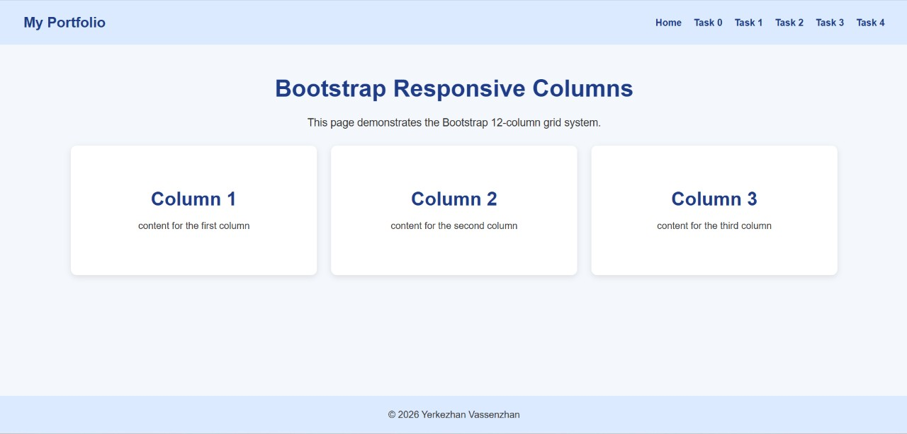
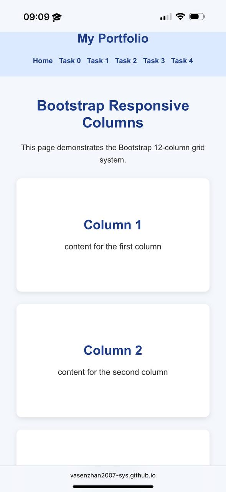

## Task 3 — Bootstrap Navigation Bar

Created a responsive **Bootstrap Navbar** with navigation links and a hamburger menu for smaller screens.

### Screenshots:
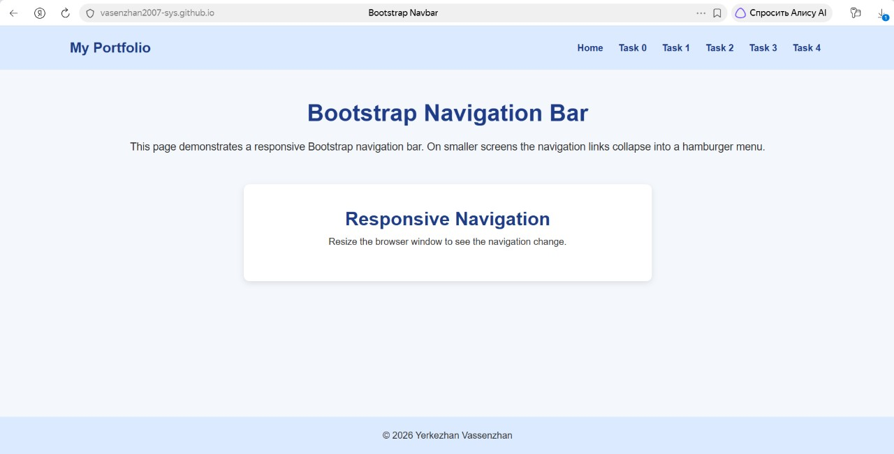
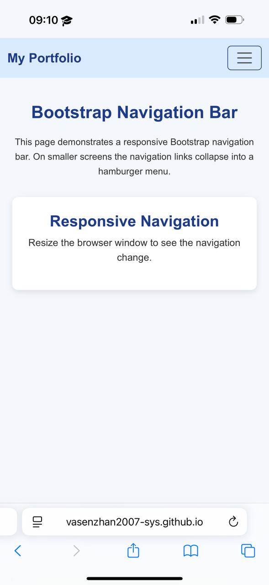

## Task 4 — Responsive Portfolio

Created a responsive portfolio using **Bootstrap Grid and CSS Media Queries**. Added projects, personal information, skills and contact details.

### Screenshots
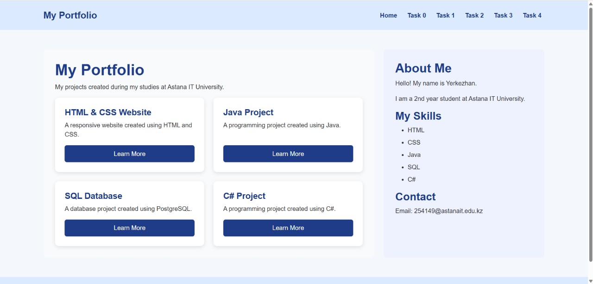
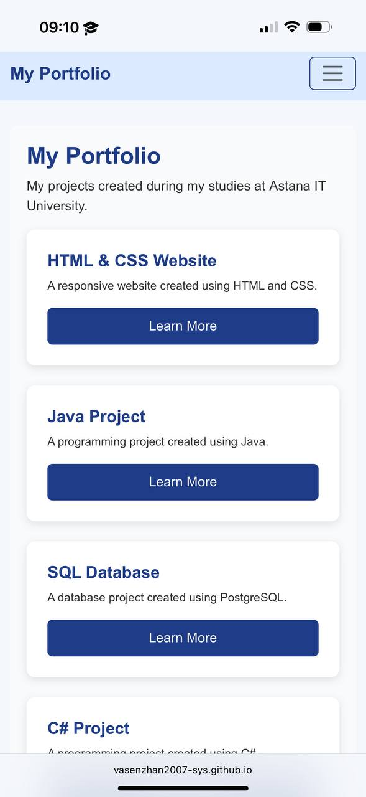

## Technologies:

- HTML
- CSS
- Media Queries
- Bootstrap 5.3
- Bootstrap Grid

## Summary

The project demonstrates responsive web design for mobile, tablet and desktop screens using CSS Media Queries and Bootstrap Grid.

## GitHub:
https://github.com/vasenzhan2007-sys/web1assignment3

## Link to website:
https://vasenzhan2007-sys.github.io/web1assignment3/web1assignment3/index.html 